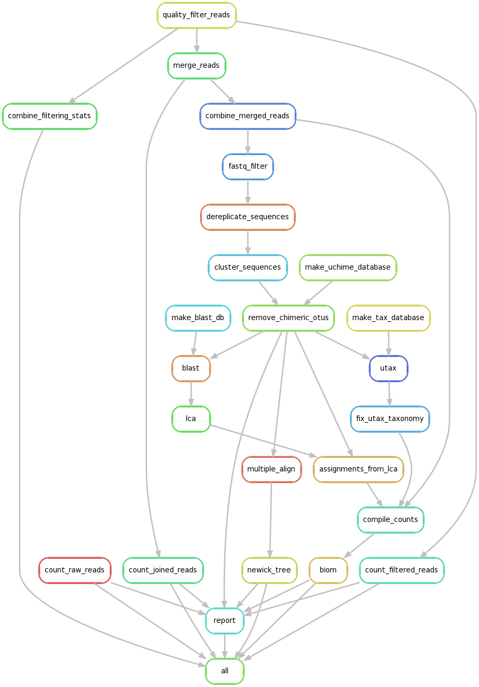
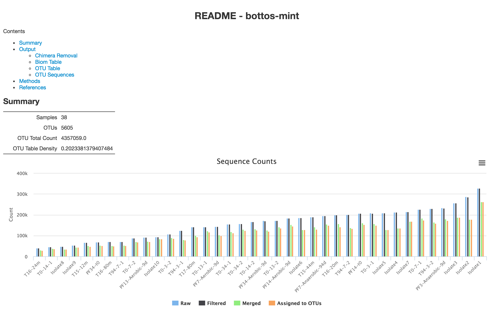

# Install

Install `snakemake` and `biom-format` using `pip`:

```
pip install snakemake biom-format
```

Install `fasttree`, `bbmap`, and `blast` (this version is usually behind the
current release) using Bioconda repository:

```
conda install -c bioconda fasttree bbmap blast
```

Download and install [usearch](http://www.drive5.com/usearch/download.html) and [clustalo](http://www.clustal.org/omega/#Download).


# Usage

Place demultiplexed, uncompressed reads into `results/<EXPERIMENT NAME>/demux`
with a `.fastq` file extension.

Uncompress the BLAST database and taxonomy file:

```
cd ref/silva_123
sh extract.sh
gunzip SLV_123_SSU.tax.gz
```

Build `lca`:

```
cd resources/lca_src
make
```

To run the workflow across 24 cores:

```
snakemake -j 24 --configfile resources/16s.config.yaml --config eid=<EXPERIMENT NAME>
```

Results are written to `results/<EXPERIMENT NAME>/<PERCENT ID>/`.

Methods and summary data can be found in `results/<id>/<percent_identity>/README.html`


