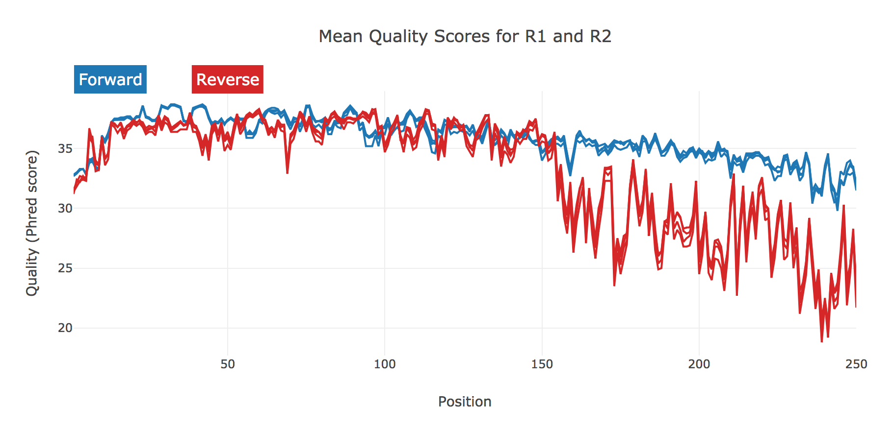
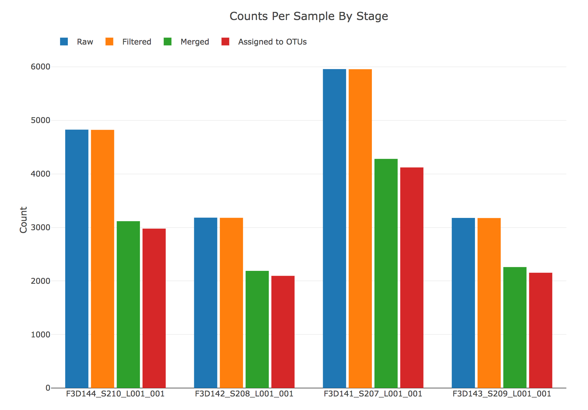
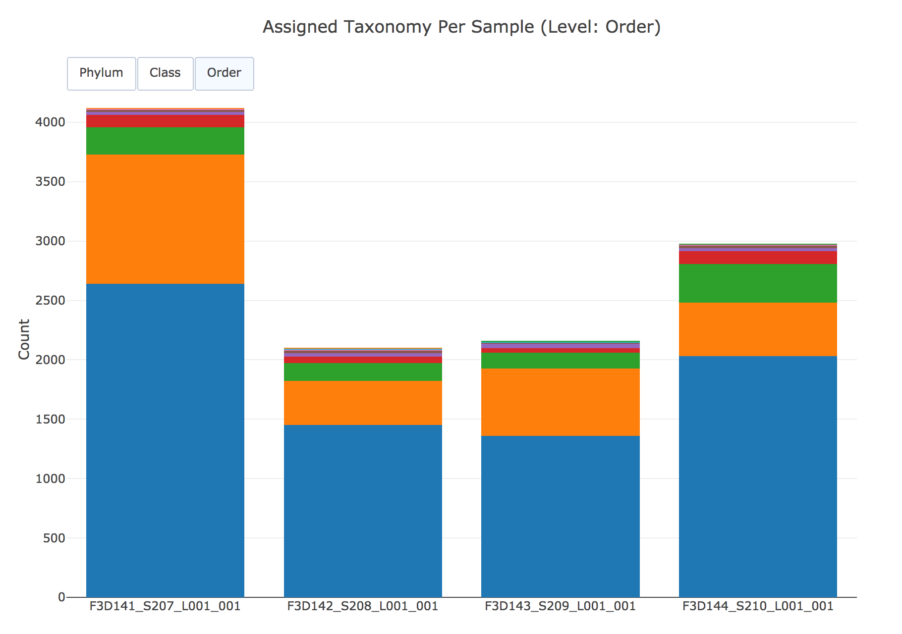

Annotation Output
=================

An interactive example is available at https://pnnl.github.io/hundo/.

**OTU.biom**

Biom table with raw counts per sample and their associated taxonomic
assignment formatted to be compatible with downstream tools like
phyloseq.

**OTU.fasta**

Representative DNA sequences of each OTU.

**OTU.tree**

Newick tree representation of aligned OTU sequences.

**OTU.txt**

Tab-delimited text table with columns OTU ID, a column for each sample,
and taxonomy assignment in the final column as a comma delimited list.

**OTU\_aligned.fasta**

OTU sequences after alignment using MAFFT.

**all-sequences.fasta**

Quality-controlled, dereplicated DNA sequences of all samples. The
header of each record identifies the sample of origin and the count
resulting from dereplication.

**blast-hits.txt**

The BLAST assignments per OTU sequence.

**summary.html**

Captures and summarizes data of the experimental dataset. Things like
sequence quality:

And counts per sample at varying stages of pre-processing:

Taxonomies are also summarized per sample across phylum, class, and
order:

